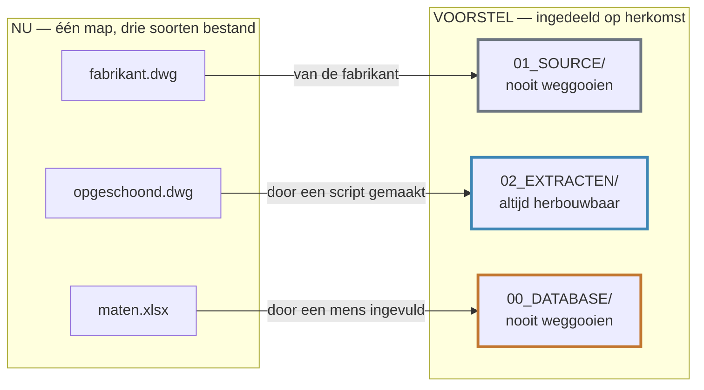
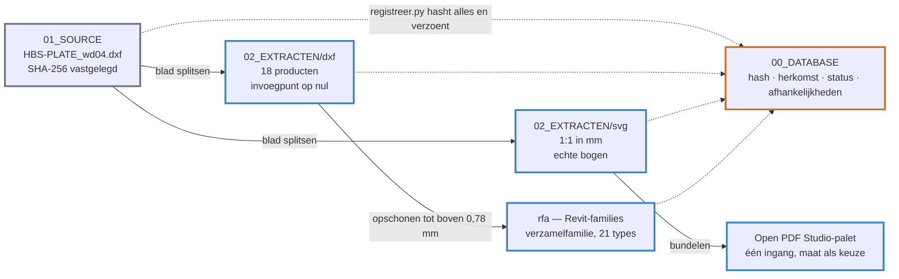
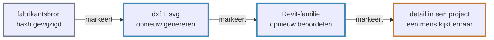

# Van fabrikantsbestand tot Revit-familie

**Een voorstel voor waar Ocondat voor is, hoe de bibliotheek werkt, en hoe hij
eruitziet als je hem gebruikt.**

| | |
|---|---|
| **Aan** | Maarten Vroegindeweij |
| **Van** | Piet · 3BM Engineering |
| **Datum** | 28-08-2026 |
| **Status** | Voorstel — niets besloten, niets verplaatst, niets verwijderd |
| **Pilot** | Rothoblaas HBS PLATE · 18 producten |

> **English.** A proposal for what Ocondat is *for*, how the library should
> work, and what it looks like in use. Nothing is moved or deleted: the existing
> `DXF Library/` is untouched. The accompanying pull request is a draft, meant to
> be read rather than merged.

---

## 1. Waar Ocondat voor is

De repo verzamelt bouwdata maar zegt nergens waarvoor. Dat is de eerste vraag
die een bezoeker stelt, en het is ook de vraag waar alle andere keuzes uit
volgen. Dit is een voorstel voor dat antwoord.

> Het doel is een **leveranciersonafhankelijke productbibliotheek** op te bouwen
> waarin technische producten van verschillende fabrikanten centraal worden
> beheerd en gecontroleerd.

Fabrikantbestanden centraal verzamelen, versieerbaar en traceerbaar opslaan, op
actualiteit controleren, hergebruiken als 2D-vector, op schaal toepassen in
PDF-tekeningen, gebruiken als 2D Revit-family en eventueel als 3D BIM-object —
en **automatisch signaleren wanneer een product of bronbestand is gewijzigd,
vervangen of uitgefaseerd**.

Twee uitgangspunten volgen daaruit, en die bepalen vervolgens de hele opzet.

**Eén product is niet één bestand.** Een fabrikant kan voor hetzelfde artikel
meerdere DXF-aanzichten leveren, plus een RFA, een IFC, een STEP en een
datasheet. Elk daarvan is een eigen bron. Geen ervan vervangt stilzwijgend een
ander — een vereenvoudigd IFC mag nooit een fabrikant-DXF overrulen voor
2D-detailwerk.

**De fabrikant levert de bron, wij maken het afgeleide.** Alles wat wij
produceren draagt de hash van het bestand waar het uit komt. Daardoor is een
gewijzigde fabrikantsbron te detecteren — ook als naam en URL gelijk blijven —
en is te bepalen wat er stroomafwaarts opnieuw beoordeeld moet worden.

Rothoblaas is de eerste leverancier waarop dit is toegepast, maar de opzet is er
niet specifiek voor. Würth, Fischer, Hilti, Leviat, Schöck, staalproducenten en
plaatleveranciers passen in hetzelfde model; elke leverancier krijgt een eigen
bronconfiguratie voor de formaten die hij werkelijk levert.

---

## 2. De vraag die het pad nu niet beantwoordt

De bibliotheek is nu ingedeeld op bouwdeel — `001 Vloeren`,
`002 Aluminium kozijnen`, `Componenten/28 Staalconstructie`. Goed om in te
zoeken. Maar bij beheer stel je een andere vraag, en het pad geeft daar geen
antwoord op:

> Mag ik dit bestand weggooien, of is het onvervangbaar?

Een fabrikants-DWG, een door ons opgeschoonde versie en een handmatig ingevulde
maattabel kunnen naast elkaar in dezelfde map staan zonder dat er iets in het
pad zegt welke van de drie het is. Daardoor kun je niet veilig opruimen, niet
zien of iets nog actueel is, en niets automatiseren — een generator heeft een
vaste bron- en doelmap nodig.

*Dezelfde drie bestanden. Links zegt het pad niets over wat je mag weggooien;
rechts beantwoordt het pad die vraag zelf.*

Het voorstel is daarom om in te delen op **herkomst** in plaats van op bouwdeel.
Eén vraag bepaalt waar iets hoort: waar komt het vandaan?

| Map | Herkomst | Weggooien en opnieuw maken? |
|---|---|---|
| `01_SOURCE` | van de fabrikant | nooit — read-only, bewaren voor altijd |
| `02_EXTRACTEN` | door een script gemaakt | ja, volledig — mag in zijn geheel weg |
| `00_DATABASE` | door een mens ingevuld | nee — beslissingen en historie |
| `_TOOLS` | code | via versiebeheer |
| `99_ARCHIVE` | vervangen versies, per datum | nee — traceerbaarheid |

Het bouwdeel verdwijnt daarbij niet. Het verhuist van het pad naar een kolom —
`category` in `products.csv` — naast NL-SfB, leverancier en productlijn. Daar
kun je erop filteren zonder ooit een bestand te verplaatsen.

---

## 3. Hoe het werkt

Eén fabrikantsblad gaat erin, een set losse producten komt eruit — als tekening,
als vector en als Revit-familie. De administratie wordt daarna niet bijgehouden
maar *verzoend*: een script loopt de schijf af, hasht alles, en meldt het
verschil met de database.

*De keten is niet lineair: DXF en SVG komen allebei rechtstreeks uit de bron,
alleen de Revit-familie komt uit de DXF. Alles onder `02_EXTRACTEN` mag weg en
opnieuw.*

Daar hoort één harde regel bij: **pas nooit met de hand iets aan in
`02_EXTRACTEN`**. De volgende generatieslag overschrijft handwerk geruisloos.
Klopt er iets niet, dan pas je de generator aan — waarmee de kwaliteitscontrole
de generator geldt en niet het losse bestand.

### Waar het allemaal om begonnen is

De hash is niet administratie om de administratie. Hij is het enige dat de vraag
beantwoordt of een detail dat vorig jaar getekend is nog klopt met wat de
fabrikant vandaag levert.

*Zonder vastgelegde afhankelijkheden weet niemand welke tekeningen een gewijzigde
schroef raakt. Met dit spoor is dat een lijst.*

Een gewijzigde bron wordt daarbij nooit stilzwijgend in de bibliotheek gezet: de
oude versie gaat eerst naar `99_ARCHIVE/<datum>/`, zodat achteraf vast te stellen
is welke fabrikantversie beschikbaar was toen een detail gemaakt werd.

---

## 4. Hoe het eruitziet als je het gebruikt

Dit is het deel dat telt voor wie er straks mee tekent. De bibliotheek is geen
archief om in te bladeren; het resultaat moet op drie plekken zonder nadenken
bruikbaar zijn.

**In een PDF-tekening — één palet-ingang met een maat-keuze.** Niet achttien
losse stempels, maar één ingang per aanzicht waar je de maat kiest in het
eigenschappenpaneel. De vectoren zijn 1:1 in millimeters, dus ze landen op ware
maat en kloppen op 1:1 net zo goed als op 1:20. Bogen blijven echte bogen — geen
polygonen, want die zijn bij terugmeten niet meer te herstellen.

**In Revit — één familie, alle maten als type.** Een verzamelfamilie volgens de
NLRS-conventie (`NLRS_28_DI_UN_schroef_HBS-PLATE_Rothoblaas_bluetek`), met de
kale productcode als typenaam en de maten in `OCD_`-parameters. Detaillijnen,
geen CAD-import — een geïmporteerde laag sleept lijntypes mee die je later niet
meer kwijtraakt. De familie draagt zijn eigen herkomst: bronbestand, bronversie,
controledatum, bibliotheekstatus.

**In de administratie — elk bestand weet waar het vandaan komt.** Per bestand een
regel met hash, bron-URL, aanzicht, eenheid en status. Een product krijgt pas
`APPROVED` na controle; tot die tijd staat het op `REVIEW REQUIRED`. Een
verdwenen downloadlink betekent niet automatisch dat een product uit productie
is — dat wordt eerst uitgezocht, met een betrouwbaarheidsniveau erbij.

---

## 5. Wat er al draait

Dit is geen schets. De keten is één keer helemaal doorlopen, op een echt
fabrikantsblad: de HBS PLATE-schroeven van Rothoblaas, van bron tot
Revit-familie.

| | |
|---|---|
| **18** | producten, Ø8/10/12 × 60–200 mm |
| **21** | DXF- en SVG-extracten |
| **21** | types in één Revit-verzamelfamilie |
| **65** | bestanden geregistreerd en gehasht |
| **84** | afhankelijkheden — door het script onafhankelijk gereproduceerd |

Dat laatste getal is de interessantste controle: de afhankelijkheden waren met de
hand ingevuld, en `registreer.py` leidde er zelfstandig precies dezelfde 84 uit
af. Verder is elke productcode aan zijn tekening gekoppeld op **afmeting** en
niet op afstand — koppelen op het dichtstbijzijnde label gaf 14 namen voor 18
producten, omdat de lange schroeven dichter bij het label van de buurrij
uitkwamen.

> ### Wat er nog niet af is
>
> Alles staat op `REVIEW REQUIRED`, niet op `APPROVED`: de vergelijking met de
> datasheet en de ETA moet nog, en de directe downloadlink met datum ontbreekt.
> De stap van bron naar extract is bovendien nog deels handwerk, en de
> actualiteitschecker bestaat nog niet — die is beschreven, niet gebouwd. De
> generators zijn de werkscripts van deze eerste set; reken op aanpassen bij een
> volgende leverancier.

---

## 6. Wat het kost om er te komen

Niets hoeft in één keer om, en er hoeft nu niets te verdwijnen. De bestaande
`DXF Library/` blijft staan; de migratie gaat per productlijn en is vier stappen
lang.

1. **Bron terugvinden** en onbewerkt in `01_SOURCE` zetten.
2. **Herkomst vastleggen**: hash, bron-URL, downloaddatum.
3. **Generator draaien** — de extracten komen eruit.
4. **Oude map archiveren** onder `99_ARCHIVE/<datum>/`.

Is de oorspronkelijke bron niet meer te vinden, dan blijft de bestaande map
gewoon staan en noteer je dat. Een reconstructie is geen bron, en doen alsof is
erger dan het gat.

Hoe de huidige inhoud erop past:

| Nu | Straks |
|---|---|
| `DXF Library/Downloads/ArcelorMittal/IPE_dwg/` | `01_SOURCE/ArcelorMittal/IPE/CAD/` — onbewerkte fabrikantsdownload |
| `DXF Library/001 Vloeren/Kanaalplaatvloer/` | `02_EXTRACTEN/<leverancier>/Kanaalplaatvloer/dxf/`, met `category = SLAB` in `products.csv` |
| `DXF Library/Componenten/28 Staalconstructie/` | idem; de NL-SfB-code `28` verhuist naar een kolom |
| `steelprofile.json`, `Ocondat.py` | blijven waar ze zijn — dit zijn geen CAD-assets |
| `Standards/`, `Libraries/`, `BlenderBIM/` | ongemoeid; dit voorstel gaat over de CAD/BIM-assets |

---

## 7. Wat ik van je wil weten

Vraag 1 is de enige die er nu echt toe doet. Valt die verkeerd uit, dan zijn de
andere drie voorbarig.

**1. Klopt de doelomschrijving met wat je voor ogen had?**
Jij bent de repo begonnen; ik leg er een doel in dat je niet zelf hebt
opgeschreven. Als dit een andere kant op gaat dan je bedoelde, dan is dát het
gesprek.

**2. Mag fabrikants-CAD op een publieke repo?**
`01_SOURCE` is per definitie materiaal van derden. Er staan al
ArcelorMittal-downloads in, dus in de praktijk gebeurt het — maar het lijkt me
goed dit een keer expliciet per leverancier vast te leggen in `suppliers.csv`
voordat de bibliotheek groeit.

**3. Horen gegenereerde extracten in versiebeheer?**
Ze zijn herbouwbaar, dus strikt genomen niet. Eén productlijn is nu al zo'n
12 MB aan Revit-families. Alternatief is ze buiten git houden en via een release
of Git LFS leveren.

**4. Nederlands of Engels?**
De onderliggende documenten zijn Nederlands. Voor een repo onder de OpenAEC
Foundation is Engels waarschijnlijk logischer — te vertalen zodra dit richting
uitvoering gaat.

---

## 8. Wat er in de bijbehorende pull request zit

Documentatie, administratie en generatorcode. **Geen bestanden verplaatst, geen
bestanden verwijderd.** De enige bestaande file die wordt aangeraakt is
`README.md`, waar de doelomschrijving uit §1 aan is toegevoegd; de bestaande
regels en de features-lijst staan er ongewijzigd in.

| Pad | Wat |
|---|---|
| [Systeemomschrijving](Manufacturer%20CAD-BIM%20Product%20Library%20-%20systeemomschrijving.md) | de architectuur: mappen, metadata, statusmodel, actualiteitschecker, versiebeheer — **leidend document** |
| [Bibliotheek opbouwen · werkwijze](Ocondat%20bibliotheek%20instructie/Bibliotheek%20opbouwen%20-%20werkwijze.md) | de bewerkingsstappen van fabrikantstekening naar extract, met de valkuilen die we echt zijn tegengekomen |
| [02_EXTRACTEN/LEESMIJ](02_EXTRACTEN/LEESMIJ.md) | de drie extracttypen en de keten ertussen |
| [_TOOLS/LEESMIJ](_TOOLS/LEESMIJ.md) | negen generators en de volgorde om ze in te draaien |
| `00_DATABASE/` | vijf CSV's plus een manifest, gevuld met de HBS PLATE-pilot |

### Wat er bewust níet in zit

* **Geen fabrikantsbestanden.** `01_SOURCE` is leeg. Of CAD van derden op een
  publieke repo mag is vraag 2 hierboven.
* **Geen extracten.** De SVG's, DXF's en RFA's van de pilot (samen circa 15 MB)
  zijn achtergehouden; ze zijn met de generators opnieuw te maken.
* Daardoor verwijzen de `file_path`-kolommen in `00_DATABASE` naar bestanden die
  niet in de repo staan. Die rijen tonen de vorm, ze zijn geen werkende dataset.

Daarom staat de pull request op **draft**: hij is bedoeld om te lezen, niet om te
mergen. Mergen zou een lege structuur naast de bestaande zetten, en dat is niet
het voorstel.
